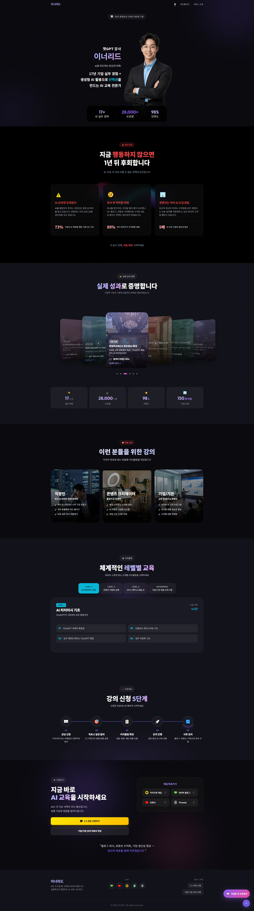

# 🚀 이너리드 (Inner Lead)

> **AI로 리드하는 당신의 미래** - 생성형 AI 교육 전문가 이너리드의 공식 웹사이트

<div align="center">


</div>

---

## ✨ 프로젝트 소개

**이너리드**는 17년 기업 실무 경험과 생성형 AI 활용 노하우를 바탕으로, 직장인·크리에이터·기업을 위한 AI 교육을 제공하는 전문 강사입니다.

이 웹사이트는 이너리드의 서비스, 포트폴리오, 그리고 AI 교육 프로그램을 소개하기 위해 제작되었습니다.



---

## 🎨 주요 기능

### 🏠 Hero Section
- 타이핑 애니메이션 효과
- 프리미엄 글라스모피즘 디자인
- **28,000+ 수강생** 대각선 시머 애니메이션

### 🎯 Target Audience
- 직장인 / 콘텐츠 크리에이터 / 기업·기관
- 인터랙티브 호버 효과와 카드 디자인

### 📂 Portfolio Coverflow
- 3D 회전 커버플로우 슬라이더
- 드래그 & 스와이프 지원
- 포트폴리오 상세 페이지 연동

### ⭐ Reviews Section
- 실제 수강생 후기
- 프리미엄 카드 기반 UI
- 스크롤 애니메이션

### 🔄 Scroll to Top
- 10% 스크롤 후 자동 표시
- 부드러운 스크롤 동작
- 펄스 애니메이션 효과

---

## 🛠 기술 스택

| 분류 | 기술 |
|------|------|
| **Frontend** | React 18, Vite |
| **Styling** | Vanilla CSS (Custom Design System) |
| **Animation** | CSS Keyframes, Transitions |
| **Routing** | React Router DOM |
| **Icons** | Lucide React |

---

## 📁 프로젝트 구조

```
src/
├── assets/          # 이미지, 아이콘
├── components/      # 재사용 가능한 컴포넌트
│   ├── Hero.jsx
│   ├── TargetAudience.jsx
│   ├── PortfolioCoverflow.jsx
│   ├── Reviews.jsx
│   ├── ScrollToTop.jsx
│   └── ...
├── pages/           # 페이지 컴포넌트
│   ├── HomePage.jsx
│   ├── Portfolio.jsx
│   └── PortfolioDetail.jsx
├── hooks/           # 커스텀 훅
└── App.jsx          # 메인 앱
```

---

## 🚀 시작하기

### 설치

```bash
# 저장소 클론
git clone https://github.com/dev-shiba/inner_lead.git

# 디렉토리 이동
cd inner_lead

# 의존성 설치
npm install

# 개발 서버 실행
npm run dev
```

### 빌드

```bash
npm run build
```

---

## 🎯 디자인 시스템

### 컬러 팔레트

| 색상 | 용도 |
|------|------|
| `#8b5cf6` | Primary (Purple) |
| `#6366f1` | Secondary (Indigo) |
| `#06b6d4` | Accent (Cyan) |
| `#0a0a0f` | Background |

### 애니메이션

- **Fade In Up/Down**: 스크롤 진입 애니메이션
- **Diagonal Shimmer**: 텍스트 하이라이트 효과
- **Float**: 부유 효과
- **Pulse**: 강조 효과

---

## 📄 라이선스

This project is licensed under the MIT License.

---

<div align="center">

**Made with 💜 by Inner Lead**

</div>
